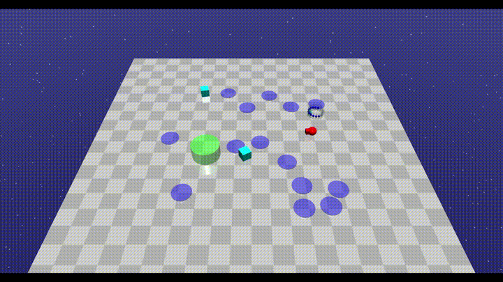
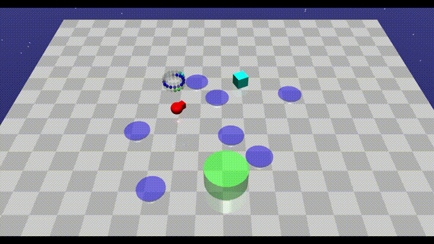
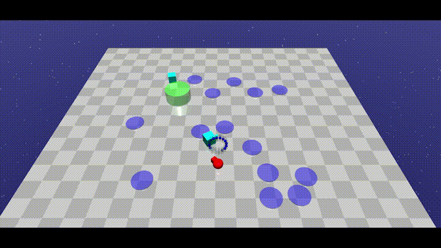
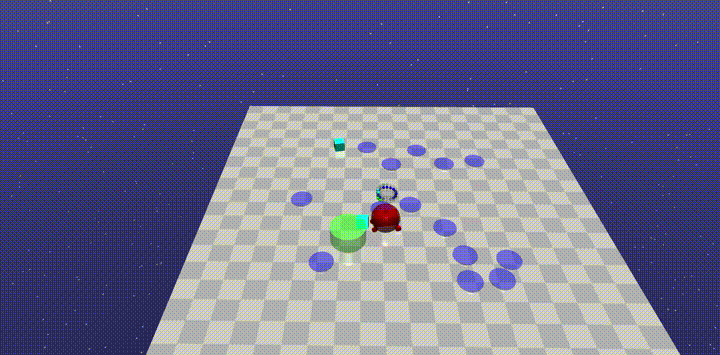
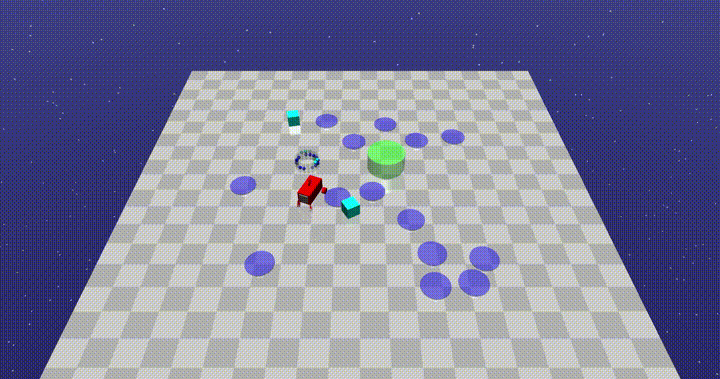

Constrained Model-based RL with Robust Cross Entropy Method
==================================
This repo contains the code for [this paper](https://arxiv.org/abs/2010.07968). <br />
[This website](https://sites.google.com/site/mpcrcesafeai2020/) contains a breif introduction to our paper.

<p align="center">
<!--     <br /> -->
    <br />
    <br />
<!--     -->
</p>

## Abstract
This paper studies the constrained reinforcement learning (RL) problem without assumptions about prior knowledge of the system dynamics and the constraint function. We employ an uncertainty-aware neural network ensemble model to learn the dynamics, and we infer the unknown constraint function through indicator constraint violation signals. We use model predictive control (MPC) as the basic control framework and propose the robust cross-entropy method (RCE) to optimize the control sequence considering the model uncertainty and constraints. We evaluate our methods in the Safety Gym environment. The results show that our approach achieves better constraint satisfaction than baseline safe RL methods while maintaining good task performance. Additionally, we are able to achieve several orders of magnitude better sample efficiency when compared to constrained model-free RL approaches.

## Supported Platforms

This repo has been tested on Ubuntu 18.04 LTS, and is probably fine for most recent Mac and Linux operating systems. 

## Setup
### Simulation Environment Installation 

Our experiment environments are modified from [Safety Gym](https://github.com/openai/safety-gym), which depends heavily on [mujoco_py](https://github.com/openai/mujoco-py). 

The first step is to install [MuJoCo-200](https://www.roboti.us/index.html): download binaries, put license file inside, and add path to `~/.bashrc`. 

Then, install mujoco_py. See the [mujoco_py](https://github.com/openai/mujoco-py) documentation for details. Note that mujoco_py **requires Python 3.6 or greater**, so our simulation environments do as well.

Afterwards, simply install our modified Safety Gym environments by:

```
cd env

pip install -e .
```

If you encouter any problems during the simulation environment installation, please see the troubleshooting section.

### Other Requirements
- PyTorch-1.4.0
- gym-0.15
- CUDA-10.0 (recommended if you want GPU acceleration)
- CUDNN-7.6 (recommended if you want GPU acceleration)

To installing other dependencies (tqdm, pyyaml, mpi4py, psutil, matplotlib, seaborn), simply run:
  ```Shell
  pip install --upgrade pip
  pip install -r requirements.txt
  ```

### LightGBM installation

Our method depends on [LightGBM](https://lightgbm.readthedocs.io/en/latest/) model; we recommend to install LightGBM package through pip or conda:

```
pip install lightgbm
```
or
```
conda install -c conda-forge lightgbm
```
We suggest you install `pytorch` first as there might be package conflicts if installing lightgbm first.

If you want to install GPU-version of LightGBM, please refer to their [documentation](https://lightgbm.readthedocs.io/en/latest/GPU-Tutorial.html).

## Structure
The structure of this repo is as follows:
```
safe-mbrl
├── baseline  # stores the model-free baseline methods used in our paper.
├── data  # stores the training data (weights, recorded variables, training config etc).
├── env  # stores the modified safety gym simulation environment (update the car robot model).
├── mbrl  # stores the safe model-based RL approach proposed by our paper.
│   ├── controllers # we use the safe_mpc_controller.py as the basic control framework.
│   ├── models # implementation of the dynamics model and the constraint model.
│   ├── optimizers # implementation of our RCE method as well as CEM and random shooting.
├── script # stores the scripts to plot and analyze the saved training data
├── utils # stores some useful functions and tools
├── config.yml # stores some hyper-parameters for mpc, dynamics model, and cost model.
├── run.py # the training and testing script to reproduce our experiment results.
```

## Usage

  
### Train with Default Configuration

Here we provide some examples about how to train the agent. Note that the training procedure may take several hours to converge depending on your computer configuration.

- Train  MPC + RCE agent in the PointGoal1 environment:
```Shell
python run.py --robot point --level 1 --dir data/pg1 -n test-rce -o rce --epoch 25 --c config.yml
```
- Train  MPC + random agent in the PointGoal2 environment:
```Shell
python run.py --robot point --level 2 --dir data/pg2 -n test-random -o random --epoch 70 --c config.yml
```
- Train  MPC + CEM agent in the CarGoal1 environment:
```Shell
python run.py --robot car --level 1 --dir data/cg1 -n test-cem -o cem --epoch 40 --c config.yml
```

#### Arguments and Parameters
| Flags and Parameters  | Description |
| ------------- | ------------- |
| ``--robot``  | robot model, selected from `point` or `car`  |
| ``--level``  | environment difficulty, selected from `1` or `2`, where `2` would be more difficult than `1`  |
| ``--epoch``  | maximum epochs to train  |
| ``--episode``  | determines how many episodes data to collect for each epoch  |
| ``--render``,``-r``  | render the environment |
| ``--test``,``-t``  | test the performance of pretrained models without training  |
| ``--seed``,``-s``  | seed for Gym, PyTorch and Numpy  |
| ``--dir``, ``-d``  |  directory to save the logging information  |
| ``--name``, ``-n``  | name of the experiment, used to save data in a folder named by this parameter  |
| ``--save``  | save the trained dynamic model, data buffer, and cost model  |
| ``--load``  | load the trained dynamic model, data buffer, and cost model from a specified directory  |
| ``--ensemble``  | number of model ensembles  |
| ``--optimizer``, ``-o``  | determine the optimizer, selected from `rce`, `cem`, or `random`  |
| ``--config``  | specify the path to the configuation file of the models  |

More hyper-parameters for the models and optimizers can be found in the `config.yml` file.

- Test with the trained model in the PointGoal1 environment:
```Shell
python run.py --robot point --level 1 -o rce --c config.yml -r -t --load data/pg1/weights/
```

- To test with some pretrained models, please download the data from this [link](https://drive.google.com/file/d/1aJuI3iwphxhtd0L_CDUHqB4XN-xPpITk/view?usp=sharing), unzip it, and replace the `data` folder with the unzipped one. 

We name each environment with the first letter of robot (`car` or `point`) + `g` (represent the Goal task) + `difficulty level`. For example, the `pg2` folder stores the experiment results for the PointGoal2 task. The trained dynamics model, data buffer, and cost model weights are stored in the `weights` folder within each environment folder. Other folders store the rewards and costs data for each method during training (the learning curves plots in the paper come from these data).

### Plot a Single Figure from Data
To plot a single figure from saved progress data, specify the directory and run:
```
python script/plot.py path/to/stored/result -y Cost --smooth 30
```
The script will parse all the sub directories in the `path/to/stored/` that contain `result` in the folder name.


Horizontal lines can be used as convergence values for model-free methods, as recalled from the proposed paper. Simply run:
```
python script/plot.py data/pg1/ensemble-rce data/pg1/ensemble-cem --hline 14 15 --linename Test1 Test2
```


The script does not yet support reading a combination of model-free and model-based data as their data length vary a lot. As a result, the plot may only show the curves for the model-free methods. Be careful when selecing the paths to files.

#### Arguments and Parameters for plot.py
| Flags and Parameters  | Description |
| ------------- | ------------- |
| Mandatory argument  | list of paths to data `progress.txt`; all sub-directories of the paths will be scanned.  |
| ``--xaxis``  | the data that will be plotted as the x-axis. e.g. `TotalEnvInteracts`, `Episode`  |
| ``--yaxis``  | the data that will be plotted as the y-axis. e.g. `EpRet` is the reward in 1 episode; `EpCost` is the cost in 1 episode  |
| ``--condition``  | how to categorize the plotted lines; select `Method` to group data by method of experiment, `BySeed` to separate individual trials  |
| ``--smooth``  | determines how much smoothening is done while plotting; larger value means more smoothening; default `50`; input `0` to turn off  |
| ``--cut``  | determines how to shorten the datasets for alignment; select `2` for no action, `1` to align each group of data, `0` for global shortest alignment |
| ``--hline``  | (Optional) the y coordinates where horizontal dotted lines will be plotted; input a list of numbers |
| ``--linename``  | (Optional) a list of strings that are the labels to the above horizontal lines, respectively  |


### Average and Aggregate from Data
As used in Table 1 in the proposed paper, mean and sum of data can be taken using the following method:
```
python script/count.py data/cg1/ensemble-rce data/cg1/ensemble-cem --sum 100
```
Mean value of the targetted label is taken across a group; e.g. mean `cost` for `RCE method`. The first `N` mean values are then summed for each group.
The output format follows: {Group name: Sum of N mean values}

#### Arguments and Parameters for count.py
| Flags and Parameters  | Description |
| ------------- | ------------- |
| Mandatory argument  | list of paths to data `progress.txt`; all sub-directories of the paths will be scanned.  |
| ``--target``  | the targetted label. e.g. `EpRet`, `EpCost`  |
| ``--condition``  | how to categorize the plotted lines; select `Method` to group data by method of experiment, `BySeed` to separate individual trials  |
| ``--cut``  | determines how to shorten the datasets for alignment; select `2` for no action, `1` to align each group of data, `0` for global shortest alignment |
| ``--sum``  | `N`, sum the first `N` elements  |


### Baseline Model Training
For complete guidance on baseline models, please refer the repo of the paper "Benchmarking Safe Exploration in Deep Reinforcement Learning."(https://github.com/openai/safety-starter-agents)

To install the baseline method:
```
cd baseline

pip install -e .
```

- Train agent with baseline model(PPO, PPO-Lagrangian, TRPO, TRPO-Lagrangian, CPO) in PointGoal1 Environment:
```Shell
python baseline/scripts/experiment.py --robot point --task Goal1 --algo trpo
```

#### Arguments and Parameters for Baselines
| Flags and Parameters  | Description |
| ------------- | ------------- |
| ``--robot``  | robot model, selected from `point` or `car`  |
| ``--task``  | environment task, selected from `Goal1` or `Goal2`, where `2` would be more difficult than `1`  |
| ``--algo``  | algorithm, selected from 'ppo', 'ppo_lagrangian', 'trpo', 'trpo_lagrangian', 'cpo'  |
| ``--seed``  | seed for Gym, PyTorch and Numpy  |

- Test with the trained model in the PointGoal1 environment:
```Shell
python baseline/scripts/test_policy.py data/path/to/experiment
```

## Troubleshooting

This section is reported based on Ubuntu 18.04.4 LTS.

#### 1. `mujoco-py` installation
Listed below are some of the errors we encountered during installation on our virtual environment:

- Missing `patchelf`
```
  error: [Errno 2] No such file or directory: 'patchelf'
  ----------------------------------------
  ERROR: Failed building wheel for mujoco-py
Failed to build mujoco-py
ERROR: Could not build wheels for mujoco-py which use PEP 517 and cannot be installed directly
```
To install and configure this dependency:
```Shell
sudo -s
curl -o /usr/local/bin/patchelf https://s3-us-west-2.amazonaws.com/openai-sci-artifacts/manual-builds/patchelf_0.9_amd64.elf
chmod +x /usr/local/bin/patchelf
```

For other errors that are already recorded by `mujoco-py`, please refer to their official [troubleshooting section](https://github.com/openai/mujoco-py#troubleshooting).

#### 2. Missing GLEW
Similar to an error outlined in mujoco-py's official site, another error may appear during execution of the program:
```
ERROR: GLEW initalization error: Missing GL version
```
To install:
```Shell
sudo apt install libglew-dev
```
To configure:  
Add the following to `.bashrc` or directly run the line on terminal
```
export LD_PRELOAD=/usr/lib/x86_64-linux-gnu/libGLEW.so
```
or
```
export LD_PRELOAD=/usr/lib/x86_64-linux-gnu/libGLEW.so:/usr/lib/x86_64-linux-gnu/libGL.so
```
**Note:** Don't forget to source the `.bashrc` file after modification.

